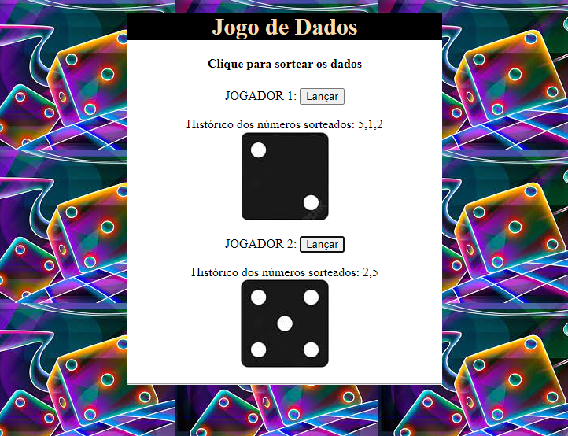

## Jogo de Dados em JS
Aqui foi desenvolvido um jogo de dados multiplayer, para dois jogadores, como requisito de avaliação dissertativa do curso de FULLSTACK. Instruções: os jogadores definirão antecipadamente quantos dados serão rolados por partida. Ex. "melhor de três": o primeiro jogador inicia o lançamento, em seguida o segundo jogador inicia o seu laçamento. E continua assim por diante até chegar no limite de laçamentos previamente definidos da partido (Nesse exemplo três lançamentos para cada jogador). 
No final, conta-se o histórico de ponto armazenado de cada um, vencendo quem tiver alcançado a maior pontuação.

## Layout do Projeto

## Tecnologias Utilizadas
Front End: HTML5, CSS e JavaScript

## Inspecionando o Código
~~~JavaScript

~~~

~~~Css

~~~

## Autor

Adalto Carvalho Ribeiro Simão Junior - Nov.22

